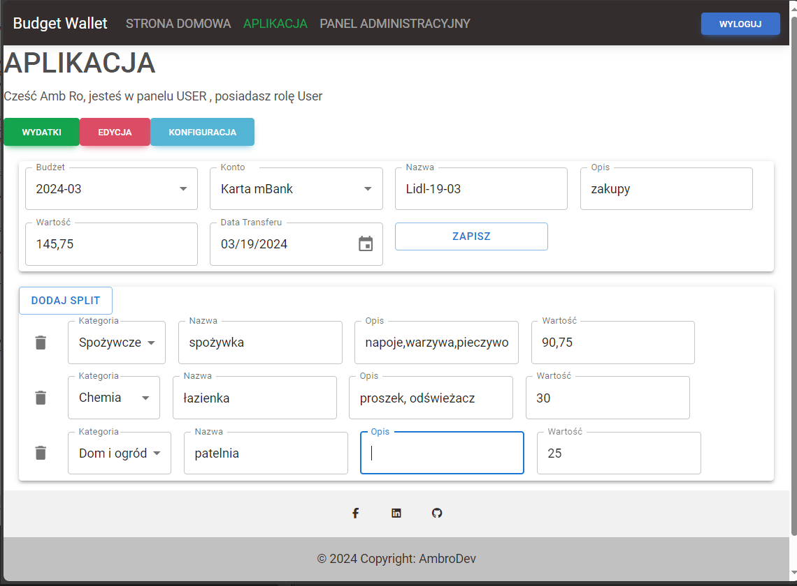
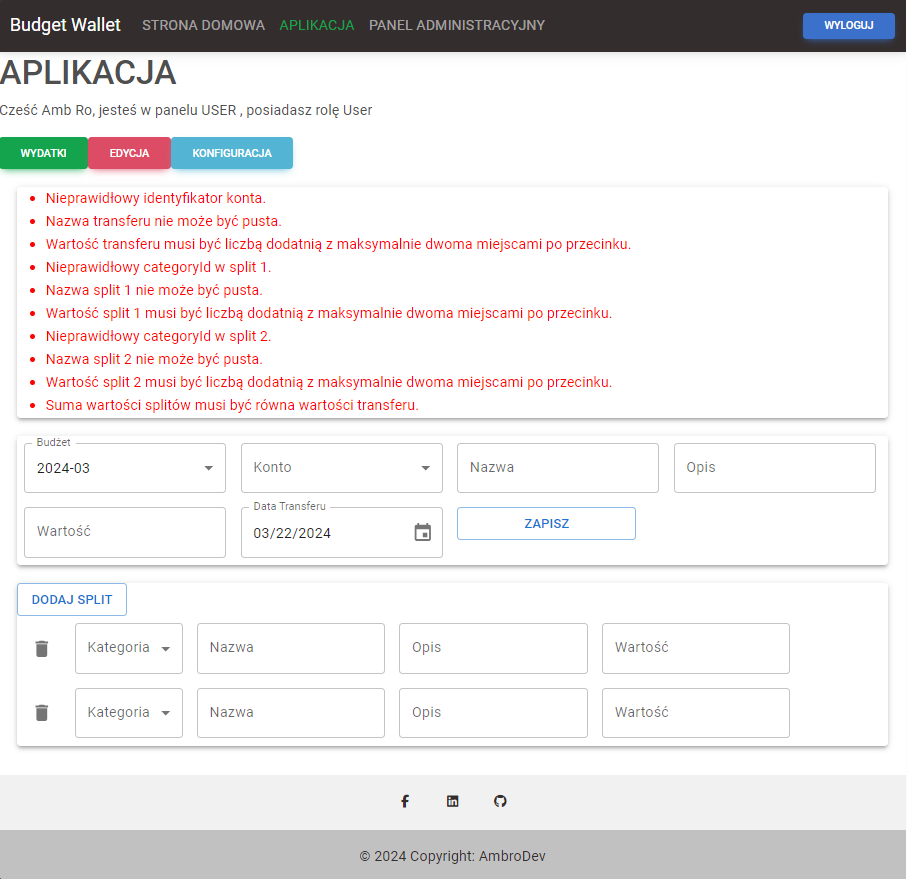
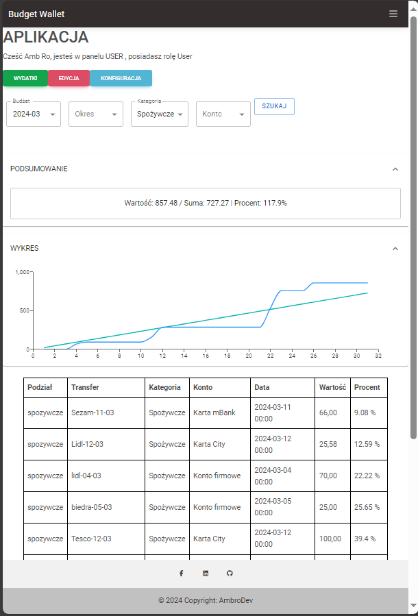
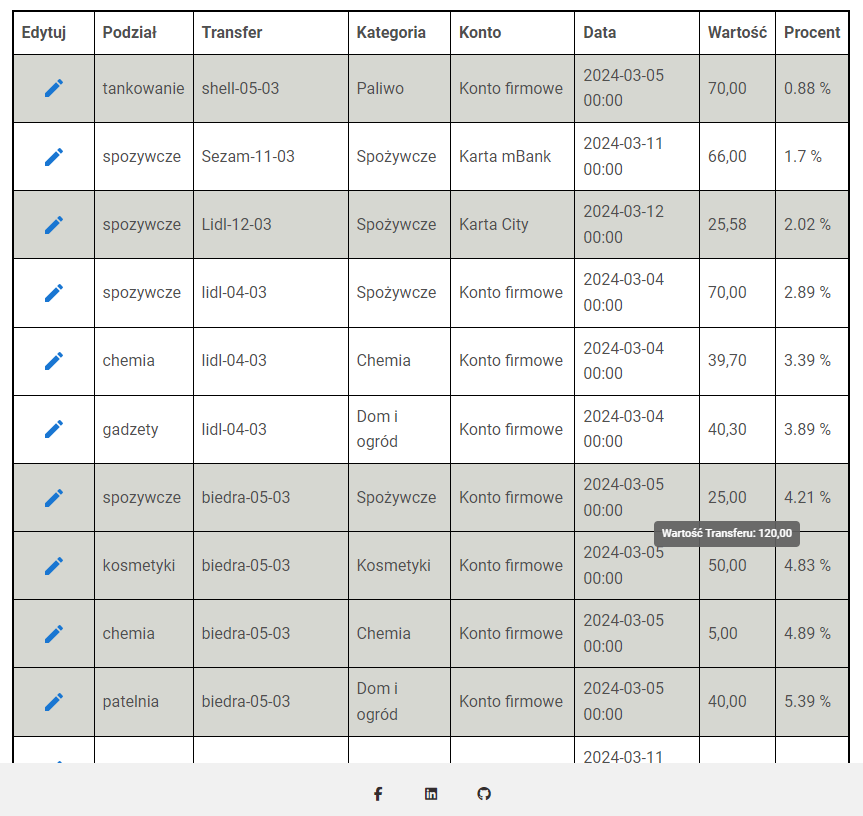
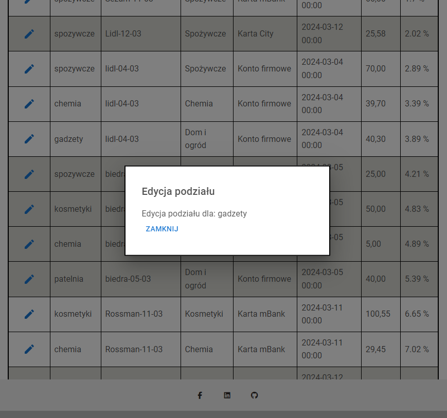
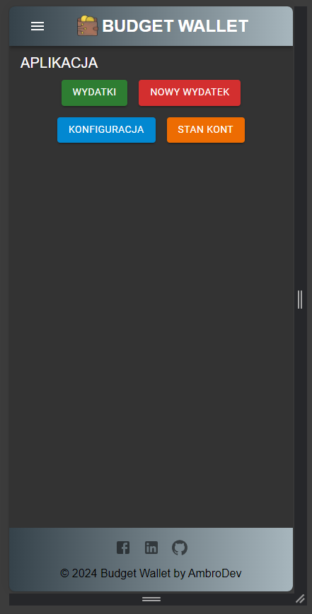
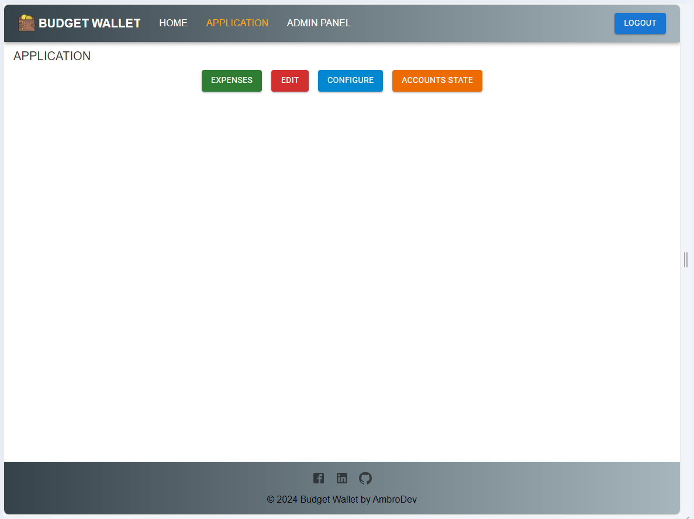
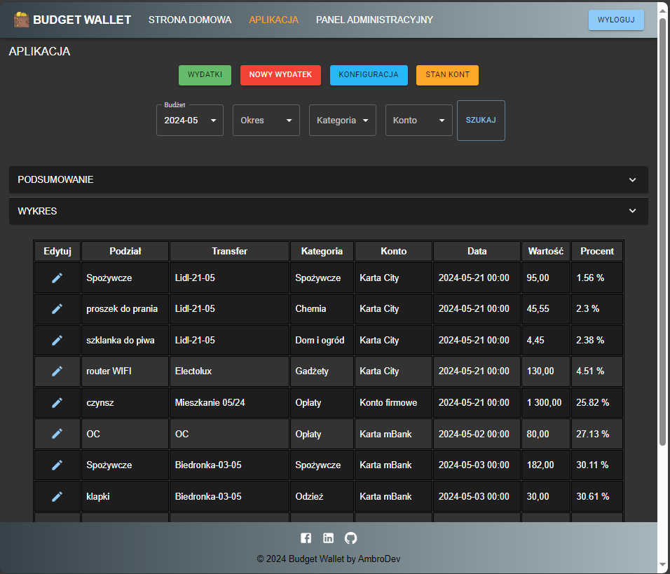
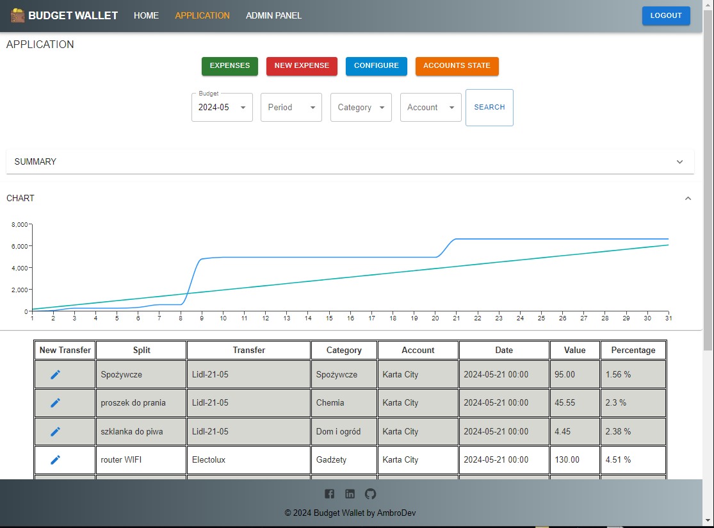
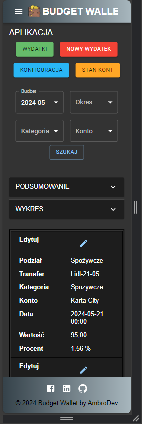

[README](../README.md)

## Diary

### Day 1
* License, gitignore, initial README

### Day 2
* Backend application skeleton: BE, WebApi, BL, DAL, Model
* Swagger
* JWT token implementation, User table, Mock user database
* Initial outline of login and registration methods

### Day 3
* Database design and addition of diagram to README
* DbContext setup, generic repositories, migration
* First draft of front-end view mockup

### Day 4
* React App: create-react-app
* login by App Account, login by Google, Register new Account (almost ready, without validator information and account confirmation)
* translations ( Browser-dependent language )
* React Router
* token saved in storage
* Material Design for Bootstrap 5 & React 18
* ApplicationRepository instead of MockRepository

### Day 5
* first deploy on Azure

### Day 6
* register user
* react-tostify for success register
* clearing register form and info from register bad request

### Day 7
* first steps to return splits of transfer by filter

### Day 8
* generic repository tests and fixes

### Day 9
* password hashed , register validator extension

### Day 10
* GetSplits run by swagger with success

### Day 11
* GetSplits on Front
* GoogleLogin problems
* Added react-super-responsive-table

### Day 12
* MockDataCreator - helper for create test data

### Day 13
* Work review and planning

### Day 14
* Added backend for filter for GetSplits
* Fix and run mockCreator to fill database
* First screens of application in readme

### Day 15
* First steps with Stats, GetSplitsFilter and Splits (FE)
* Added Material UI and used instead of MDB
* No final success :(

### Day 16
* Not beautiful, but it works :)

### Day 17
* First steps with the  add transaction and splits module.

### Day 18
* Swageer extension - use token for authorize
* IsActive - column for each Table
* Unit tests init

### Day 19
* Add Expense Extension
* It's almost ready , without validation and final save

### Day 20
* uTests - first test for IdentityService

### Day 21
* Default Date in Add Expense DatePicker
* First Steps to save new Transfer (FE site)
* Refactoring IMapperService (Interface to Abstract class)

### Day 22
* Validate new expense(transfer)before saving and display errors instead of saving

### Day 23
* Add new Expense saving with success toast and display backend errors

### Day 24
* playing with unit tests and validators

### Day 25
* Translations added (FE + BE partially)
* Language handling in Web API and other backend projects

### Day 26
* Translations of validator rules
* Default values in Add Expense
* Validators extension

### Day 27
* Percentage to Splits Table
* Data for Chart (Splits)
* Data for SplitSummary

### Day 28
* Preparation for migration to .Net 8 (and upgrading dependencies)
* Preparation for migration from CreateReactApp to Vite + TypeScript
* Review of the work plan

### Day 29
* Chart View
* Summary View

### Day 30
* Grouping splits by transfer (marking records with a common color)
* Tooltips with a description (split, transfer, account)
* Tooltips with a transfer value when hovering over the split value
* Introduction to editing the split in a modal window

 	

### Day 31
* Initiation of accounts, categories, and budgets configuration
* Edit existed Split/Transfer - almost ready
* small CSS fixes
* steps towards further changes in the configuration and split editing area

### Day 32
* Edit Transfer/Splits - It's still not finished

### Day 33
* Edit Transfer/Splits - Backend, refreesh table after transfer edition

### Day 34
* Configuration Accounts - first steps (FE+BE)

### Day 35
* Launching the whole application (API + UI + DB) in Docker
* Fix Project Name WepApi to WebApi :)

### Day 36
* Configuration - Accounts

### Day 37
* Configuration - Accounts Backend
* Configuration - Categories Full
* Fixes in splits and transfers area (logic for isActive)

### Day 38
* Hiper enigmatic dynamic condition builder for db repository
* Configuration - Budgets 33% of all
  - Show current budgets
  -	Hide/Show inactive
  -	Add new empty budget - (maximum one record)
  -	Set a default (unique) name, description, dates for new empty budget
  -	Edit icon next to each record
  -	Open budget details on click + return option available in the budgetDetails

### Day 39
* Further development of budget configurations
  - List of periods
  - List of budget categories
  
### Day 40
* Context Api for jwtToken
* Context Api for user Categories
* Budget Configurations another steps - List Of Budget period Categories

### Day 41
* Another day of battling with budget configuration
  - Complete manipulation of Budget Periods
  - Complete manipulation of Budget Categories

### Day 42
* Budget Configuration - manipulation of Budget Period Categories

### Day 43
* Budget Validation (FE) before Insert, Update - not ready

### Day 44
* Budget Validation (BE) before Insert, Update  and Save in DB
* Delete Budget Validation (FE)
* Fix refresh data in CategoriesContext after czhange

### Day 45
* Tests of Configuration Process

### Day 46
* Translations for budget configuration and budget validation

### Day 47
* So many successes with budget configuration and adding new ones, and just as many failures. Problems with UTC date. When I add a period with a date, e.g., 25-11, it changes to 24-11 (from 00:00 to 22:00). I ultimately fail to save the budget in the database. The view with the list of budgets does not refresh. It stays on the initially added budget, but it's not saved and with data before editing.

### Day 48
* Fixes for update existing Budget in Configuration
* Get Default Accounts - fixes and tests
* Get Default Categories - fixes and tests
* AccountsState Component - first steps
* Default Budget Creator - first Steps

### Day 49
* Default Budget Creator finished
* Tests - something wrong with isActive, sometimes shouldn't be visible unactive categories or categories not related to budget
* More Tests :)

### Day 50
* Budget Default Creator - Fixes

### Day 51
* Readme Update (Added Video))

### Day 52
* List of categories in various places of the application - analysis
* List of categories in various places of the application - changes and fixes

### Day 53
* Plan of Account State Area

### Day 54
* Init Api Method for Account State Area

### Day 55
* Align values helper for budget configuration
* Percent estimate in table of splits - fix

### Day 56
* Init View for add transfer (internal or deposit) in AccountsState

### Day 57
* Init new UI Project (Vite + React + TS/TSX) - not pushed
* Init 5 new empty conrollers (Category,Account,Budget,Transfer,DefaultCreator) to replace ApplicationController

### Day 58
* Refactoring - controlers Category and Account with summary description - not yet used 
* Refactoring of new UI Project (Vite + React + TS/TSX) - not pushed

### Day 59
* Refactoring - all controllers with changing endpoints in front-end ui app
* info about run

### Day 60
* Add new Vite React TS App

### Day 61
* DateTimeProvider
* Init EmailService and use it in registration process

### Day 62
* Vite TS React Login/Register area fix

### Day 63
* Vite TS React Login/Register area another fixes

### Day 64
* Design Fix
* Screens from the new frontend based only on React MUI.

 
 
### Day 65
* Rewriting the application from JavaScript to TypeScript is a very time-consuming process. This is the next stage of that process
 
### Day 66
* JS to TS conversion
 
### Day 67
* JS to TS conversion 2
 
### Day 68
* JS to TS conversion 3 (Add Expense/ edit expense/ toast success)
 
### Day 69
* Problems with Configuration when i try to rewrite to TS

### Day 70
* Tests TS App and prearation list of errors

### Day 71
* JS to TS conversion Budget Configuration area

### Day 72
* Configuration Tests

### Day 73
* Configuration Tests part 2

### Day 74
* Budget Configuration TS Fixes
* Toast Fixes

### Day 75
* Login and Register fixed response on the first click
* transfer editing fix
* Align to budget period functionality fix - still requires minor adjustment.

### Day 76
* Type Script Gui tests

### Day 77
* Account State Init in TS Application
* Added transfer deactivation
* React Mui Select with ID = 0 fix
* Facebook Login/ GitHub Login Recognition

### Day 78
* Internal/Deposit Transfer save

### Day 79
* Internal/Deposit Transfer save fixes
* Internal/Deposit Transfer save validator

### Day 80
* Account State Table

### Day 81
* Deposit/Internal Transfers Table

### Day 82
* Facebook login

### Day 83
* New version of application deployed on azure (React Vite type Script + MUI)
* Facebook login doesn't work on azure :(

### Day 84
* Facebook login works :)
* Tests on beta version on azure and finding issues
   Align Budget Period values after changing Budget Category - doesn't work perfectly
   Problem with decimal numbers when adding a transfer
   Decimal value on a split works only with a dot, but with a comma it returns an unclear error
   Lack of default sorting for splits and internal transfers by date in tables
* Some screens from azure (darkMode,lightMode,translations,mobile)

	
		 

### Day 85
* Some fixes on add expense

### Day 86
* Align budget period Fix

### Day 87
* Plan of instruction content

### Day 88
* Plan of instruction content 2

### Day 89
* Init clone budget method

### Day 90
* Init home page and instruction

### Day 91
* finished instruction in polish

### Day 92
* BudgetClone method extension - not finished yet

### Day 93
* BudgetClone method finished - but need complex tests
* BudgetClone first unitTest passed
* BudgetClone frontend action

### Day 94
* InternalTransfer add fix
* added translations
* tooltip for table
