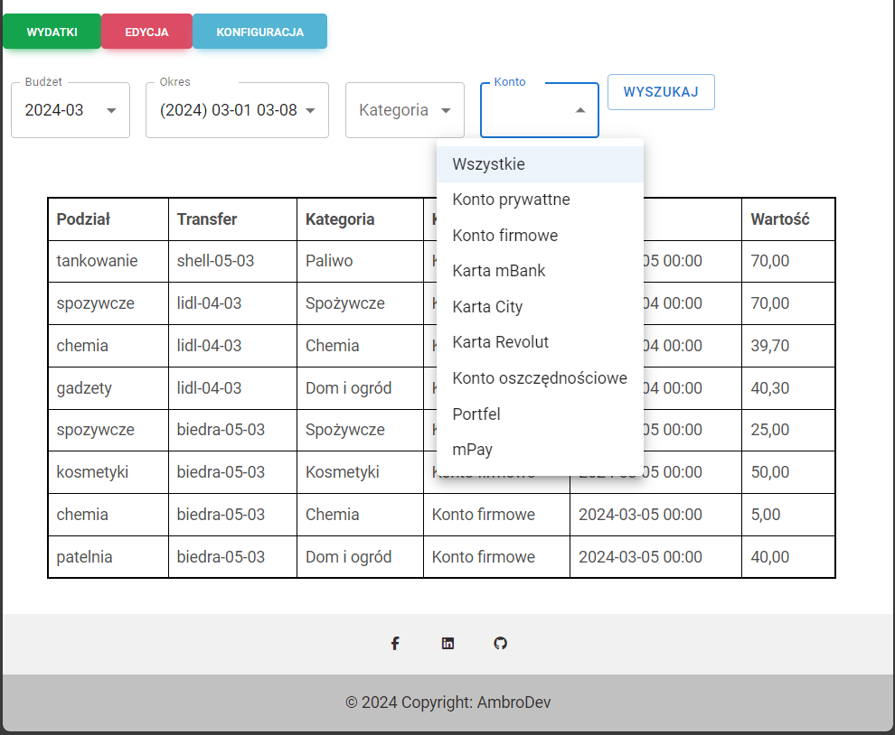
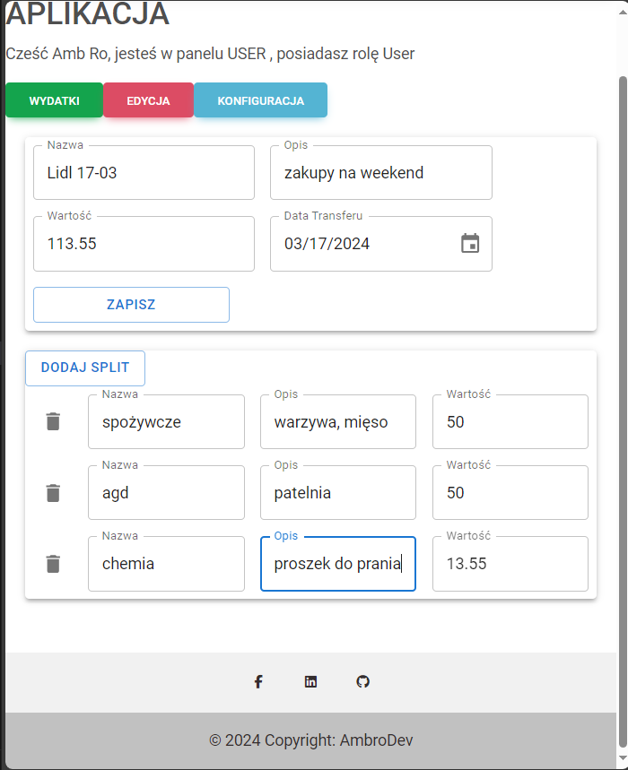

[README](../README.md)

## Diary

### Day 1
* License, gitignore, initial README

### Day 2
* Backend application skeleton: BE, WebApi, BL, DAL, Model
* Swagger
* JWT token implementation, User table, Mock user database
* Initial outline of login and registration methods

### Day 3
* Database design and addition of diagram to README
* DbContext setup, generic repositories, migration
* First draft of front-end view mockup

### Day 4
* React App: create-react-app
* login by App Account, login by Google, Register new Account (almost ready, without validator information and account confirmation)
* translations ( Browser-dependent language )
* React Router
* token saved in storage
* Material Design for Bootstrap 5 & React 18
* ApplicationRepository instead of MockRepository

### Day 5
* first deploy on Azure

### Day 6
* register user
* react-tostify for success register
* clearing register form and info from register bad request

### Day 7
* first steps to return splits of transfer by filter

### Day 8
* generic repository tests and fixes

### Day 9
* password hashed , register validator extension

### Day 10
* GetSplits run by swagger with success

### Day 11
* GetSplits on Front
* GoogleLogin problems
* Added react-super-responsive-table

### Day 12
* MockDataCreator - helper for create test data

### Day 13
* Work review and planning

### Day 14
* Added backend for filter for GetSplits
* Fix and run mockCreator to fill database
* First screens of application in readme

### Day 15
* First steps with Stats, GetSplitsFilter and Splits (FE)
* Added Material UI and used instead of MDB
* No final success :(

### Day 16
* Not beautiful, but it works :)

### Day 17
* First steps with the  add transaction and splits module.

### Day 18
* Swageer extension - use token for authorize
* IsActive - column for each Table
* Unit tests init

