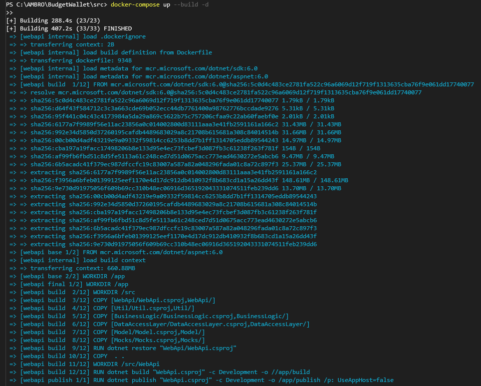
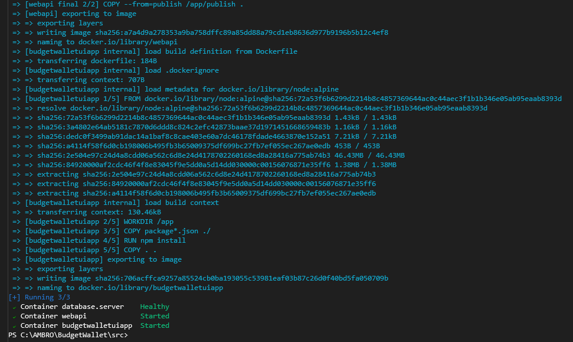
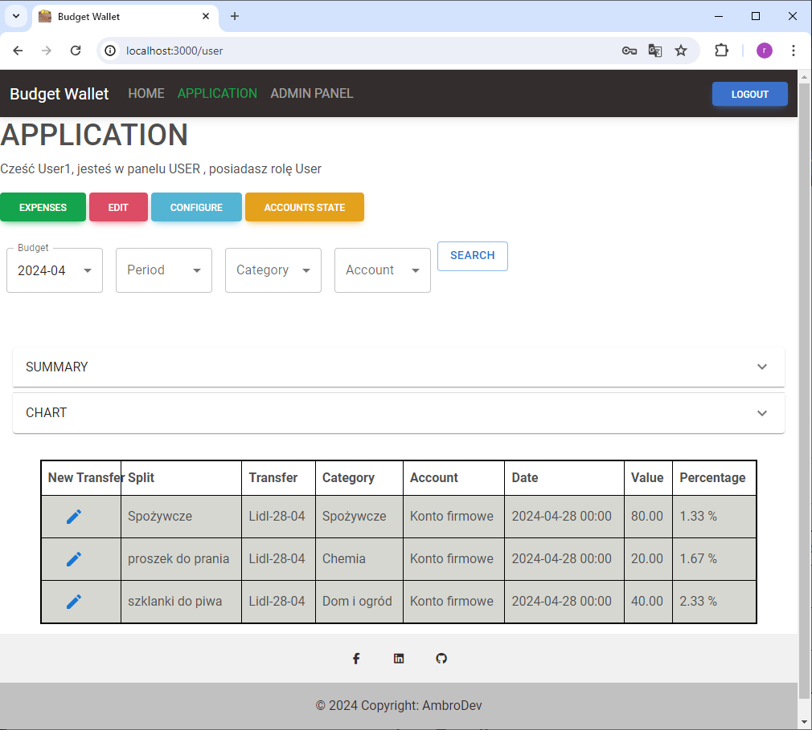
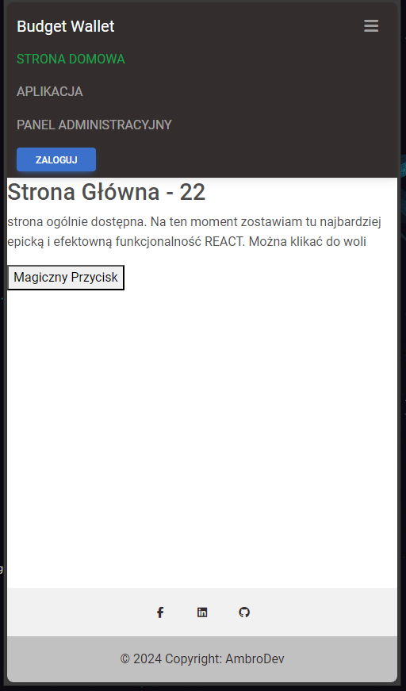
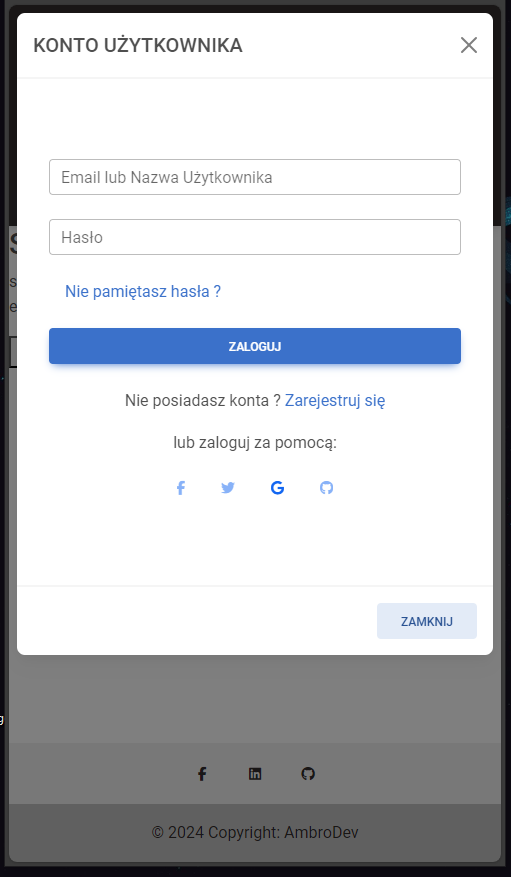
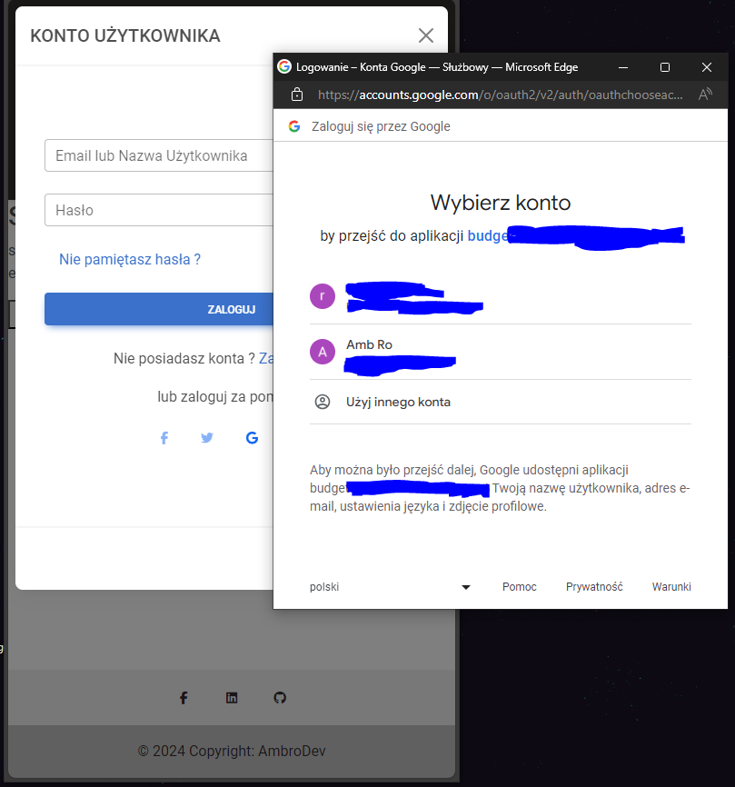
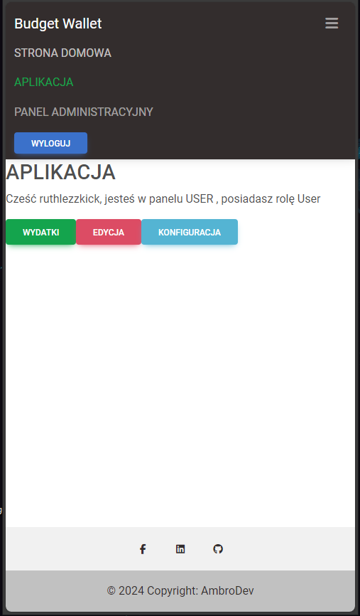
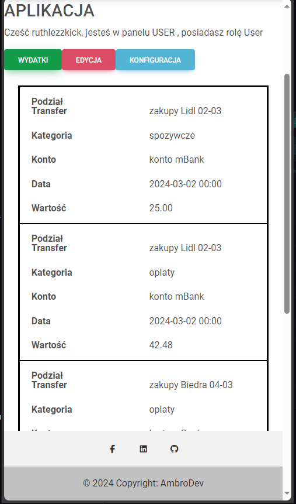

# BudgetWallet
### Web application for managing household budget
The project developed as part of the [#100 commitów - DevMentors](https://100commitow.pl/) competition.

<div align="center">
  
</div>

## Idea

In my efforts to control expenses and manage the household budget, I have tried several of the many available applications, both mobile and web-based. I have also experimented with my own and public solutions based on Excel. However, all of them had some drawbacks: either they did not provide the expected functionality or were too bloated and complicated. Excel-based solutions, which can be easily and quickly customized to suit individual needs, are more suitable for larger devices. I want to try creating a simple but functional application tailored to my own vision of the subject. It will be a web application but heavily focused on mobile devices. It should be simple and user-friendly above all.

> [!NOTE]
> [BudgetWallet Beta Version](https://budgetwallet.azurewebsites.net/)

Feel free to use your own application account or test account: [User]: Testuser1 [Password]: Testuser1!

> [!TIP]
> [Video about the project (Polish).](https://www.youtube.com/watch?v=drUR2k0tE9I)

## Challenges

* Entire Front-End. Currently, I mainly work with backend. I have experience with MVC + jQuery, legacy webforms, and recently a bit of Blazor. I'm still learning React.
* Comprehensive authorization. I have never had to worry about this somehow. This topic is usually provided out-of-the-box in corporate nuggets or other architect solutions.

## Expected Technology

* Web Api - Currently .NET 6, planned .NET 8
* Entity Framework - CodeFirst, Migrations, MSSQL, planned PostgreSQL
* Clean architecture (onion) with separation of layers into separate projects
* Front-end - Currently CRA + js files, planned Vite + tsx files
* Ready-made controls from Material UI
* A bit of react-router, but mainly SPA based on simple hooks useState/useEffect/useContext

## Functionality (from the user's point of view)

- :heavy_check_mark: Application Page Template
  -  :heavy_check_mark: Footer, Header, Body
  -  :heavy_check_mark: test data for User Panel, Admin Panel, Home
  -  :heavy_check_mark: routing
  -  :heavy_check_mark: authentication and authorization , permissions
- :white_square_button: Login/Register Modal
  - :heavy_check_mark: login by Application User
  - :heavy_check_mark: go to Register
  - :heavy_check_mark: login by Google
  - :heavy_check_mark: login by Facebook
  - :x: login by Microsoft, GitHub etc.
  - :heavy_check_mark: register user form
  - :heavy_check_mark: success toast
  - :heavy_check_mark: bad request informations
  - :heavy_check_mark: clearing form
  - :x: sending email confirmation
  - :x: remember me
  - :x: forgot password
- :white_square_button: Application (User Panel)
  - :heavy_check_mark: buttons - expenses, add expense, configuration, account state
  - :heavy_check_mark: expenses
    - :heavy_check_mark: get expenses(splits)
    - :heavy_check_mark: filter for get expenses -> data for filter and filter manipulation
    - :heavy_check_mark: data for summary and presentation summary
    - :heavy_check_mark: data for chart and chart
    - :heavy_check_mark: more details of data row
	- :heavy_check_mark: edit transfer
  - :heavy_check_mark: add (new expense)
  - :heavy_check_mark: configuration
    - :heavy_check_mark: add/edit categories
    - :heavy_check_mark: add/edit accounts
    - :heavy_check_mark: add/edit budget (with budgetCategories), budget period (with budgetPeriodCategories)
  - :white_square_button: account state
    - :heavy_check_mark: add internal transfer or deposit
	- :x: edit internal transfer or deposit
	- :heavy_check_mark: account values
	- :heavy_check_mark: table of internal transfers and deposits

## Information about installation, startup, and deployment of the application

### Setting Google Client Id

Change the value in file `.\BudgetWallet\src\budgetwalletuiapp\src\config.js` GOOGLE_CLIENT_ID: ADD_YOUR_GOOGLE_CLIENT_ID_HERE.apps.googleusercontent.com to your Google Client Id. If you don't do this, you will still be able to use the application, but without logging in with your Google account.
How to configure Google and obtain this ID will be shown shortly

### Running by dotnet, npm  independently and and use an existing MS SQL database

In a very classic scenario. If you are using Visual Studio (which by default comes with MS SQL Express) and/or Visual Studio Code, and you have added MSSQL Express,
Change the connection string to the database in file .\BudgetWallet\src\WebApi\appsettings.json.  For example, like this:

```json
"ConnectionStrings": {
    "DefaultConnection": "Data Source=(localdb)\MSSQLLocalDB;Initial Catalog=BudgetWalletDB;Integrated Security=True;Connect Timeout=30;Encrypt=False;TrustServerCertificate=False;ApplicationIntent=ReadWrite;MultiSubnetFailover=False"
  },
```

Change Issuer and Audience in this file:

```json
"ConnectionStrings": {
	"Issuer": "https://localhost:7006",
	"Audience": "https://localhost:7006"
  },
```

And change endpoint in file `.\BudgetWallet\src\budgetwalletuiapp\src\config.js`

```json
 API_BASE_URL: "https://localhost:7006",
```

Now run applications:

While in the `.\BudgetWallet\src\budgetwalletuiapp\src` folder, you can run npm command:

```json
npm start
```

While in the `.\BudgetWallet\src\WebApi` folder, you can run dotnet command:

```powershell
dotnet run
```

Api now listening on: `http://localhost:5006` and `https://localhost:7006`
UI (React) application is running at address `http://localhost:3000`


### Running in Docker (example on Windows, but I'm confident the process will work on macOS and Linux)

"In my case, I use PowerShell. While in the `.\BudgetWallet\src` folder, you can run the Docker-compose command:"

```powershell
docker-compose up --build -d
```
This is how it looks:

<div align="center">


 	

</div>

The application has started on port 3000.

<div align="center">



</div>


## Entities

This database schema emerged after the initial analysis:

<div style="text-align:center"></div>

* Users - table of users with roles
* RegisterConfirmations - auxiliary table for the registration process and account confirmation via email
* Accounts - understood as e.g., private bank account, business bank account, savings account, credit card, cash in wallet, mPay, Revolut ...
* Categories - defined expenditure categories e.g., utilities, groceries, clothing, entertainment, fuel ...
* Transfers - mainly expenses but also transfers with deposits to the account and internal transfers between accounts
* Splits - an isolated part of a single transfer e.g., Store-21-07 split into categories: e.g., groceries, chemicals, alcohol
* Budgets - defined single budget period e.g., month March - 2024
* BudgetPeriods - possible further breakdown of the budget into smaller periods e.g., weekly, helpful when certain categories within one budget March-2024 will have asymmetric expenses in this period. e.g., Utilities are 90% in the first week and 10% in the second, weeks 3 and 4 have no expenses.
* BudgetCategories - used to define expenditure limits for a given category within a budget
* BudgetPeriodCategories - as above, but monthly expenses for e.g., utilities can be split asymmetrically between periods
* TransferTemplates - additional helper facilitating expense entry by the user


## Front-end Mockups

1. View 1

<div style="text-align:center"></div>

* This is the basic view of the application, defaulting to Stats (the other two views in this area will be used for adding payments and managing settings).
* The Budget, Period, Account, and Category filters will be pre-filled but can be changed via dropdowns.
* It should display a list of expenses considering the set filter, graphical representation of these expenses vs. the budgeted amount, and some summarization of this table.
* Note: Filtering by accounts applies when selecting a specific account instead of ALL in the Account filter. In that case, the summarization may not make complete sense. This needs to be addressed somehow. 
* The colorful buttons next to CATEGORY are a helper to facilitate selecting one of the 5 most popular categories without a dropdown.

> [!NOTE]
> [Diary](/Description/DiaryReadme.md) Activity and code change log

## First screens from the application
(browser set to Polish language)

I know, the design is very basic, but for now, I prioritize functionality. Most are scaled for mobile screens. The last one is a table for larger screens

<div align="center">


 
  

</div>

<div align="center">


 
  

</div>

<div align="center">


 	

</div>


