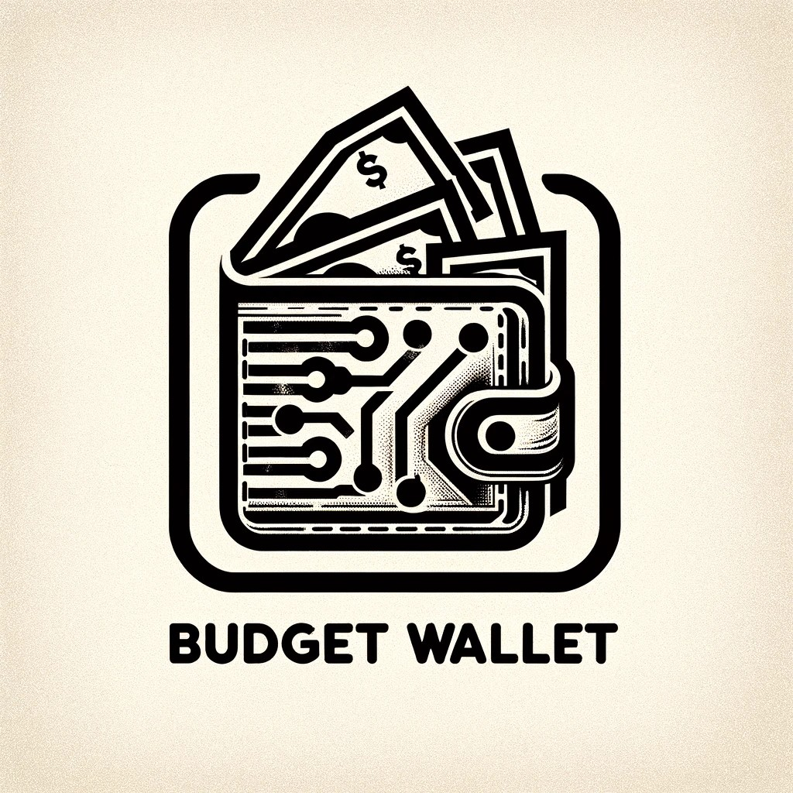
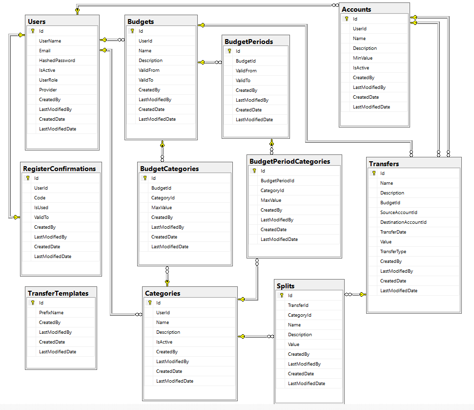
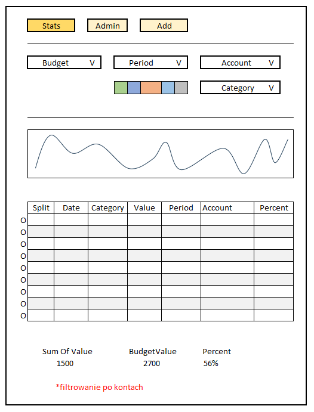

# BudgetWallet
### Web application for managing household budget

<div style="text-align:center"></div>

## Idea

In my efforts to control expenses and manage the household budget, I have tried several of the many available applications, both mobile and web-based. I have also experimented with my own and public solutions based on Excel. However, all of them had some drawbacks: either they did not provide the expected functionality or were too bloated and complicated. Excel-based solutions, which can be easily and quickly customized to suit individual needs, are more suitable for larger devices. I want to try creating a simple but functional application tailored to my own vision of the subject. It will be a web application but heavily focused on mobile devices. It should be simple and user-friendly above all.

## Challenges

* Entire Front-End. Currently, I mainly work with backend. I have experience with MVC + jQuery, legacy webforms, and recently a bit of Blazor. I'm still learning React.
* Comprehensive authorization. I have never had to worry about this somehow. This topic is usually provided out-of-the-box in corporate nuggets or other architect solutions.

## Expected Technology

* Web Api - probably in .Net 6 - currently, my IDE is not quite ready for another LTS version
* Entity Framework - CodeFirst, Migrations
* Clean architecture (onion) with separation of layers into separate projects
* Front-end application mostly created using create-react-app
* Ready-made controls from Material Design for Bootstrap 5 & React 18
* A bit of react-router, but mainly SPA based on simple hooks useState/useEffect

## Entities

This database schema emerged after the initial analysis:

<div style="text-align:center"></div>

In addition, there are 3 enums:
```csharp
public enum Provider
{
	Application,
	Google
}

public enum TransferType
{
	Deposit,
	Withdrawal,
	InternalTransfer
}

public enum UserRole
{
	User,
	Admin
}
```

* Users - table of users with roles
* RegisterConfirmations - auxiliary table for the registration process and account confirmation via email
* Accounts - understood as e.g., private bank account, business bank account, savings account, credit card, cash in wallet, mPay, Revolut ...
* Categories - defined expenditure categories e.g., utilities, groceries, clothing, entertainment, fuel ...
* Transfers - mainly expenses but also transfers with deposits to the account and internal transfers between accounts
* Splits - an isolated part of a single transfer e.g., Store-21-07 split into categories: e.g., groceries, chemicals, alcohol
* Budgets - defined single budget period e.g., month March - 2024
* BudgetPeriods - possible further breakdown of the budget into smaller periods e.g., weekly, helpful when certain categories within one budget March-2024 will have asymmetric expenses in this period. e.g., Utilities are 90% in the first week and 10% in the second, weeks 3 and 4 have no expenses.
* BudgetCategories - used to define expenditure limits for a given category within a budget
* BudgetPeriodCategories - as above, but monthly expenses for e.g., utilities can be split asymmetrically between periods
* TransferTemplates - additional helper facilitating expense entry by the user


## Front-end Mockups

1. View 1

<div style="text-align:center"></div>

* This is the basic view of the application, defaulting to Stats (the other two views in this area will be used for adding payments and managing settings).
* The Budget, Period, Account, and Category filters will be pre-filled but can be changed via dropdowns.
* It should display a list of expenses considering the set filter, graphical representation of these expenses vs. the budgeted amount, and some summarization of this table.
* Note: Filtering by accounts applies when selecting a specific account instead of ALL in the Account filter. In that case, the summarization may not make complete sense. This needs to be addressed somehow. 
* The colorful buttons next to CATEGORY are a helper to facilitate selecting one of the 5 most popular categories without a dropdown.


[Diary](/Description/DiaryReadme.md)


